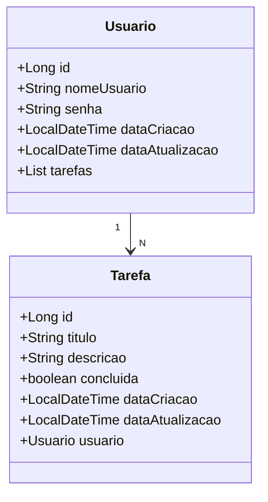

# Agenda
Uma agenda de tarefas criada em Java, SpringBoot e Maven

```mermaid
classDiagram
    class Usuario {
        +Long id
        +String nomeUsuario
        +String senha
        +LocalDateTime dataCriacao
        +LocalDateTime dataAtualizacao
        +List<Tarefa> tarefas
    }

    class Tarefa {
        +Long id
        +String titulo
        +String descricao
        +boolean concluida
        +LocalDateTime dataCriacao
        +LocalDateTime dataAtualizacao
        +Usuario usuario
    }

    Usuario "1" --> "N" Tarefa
```
